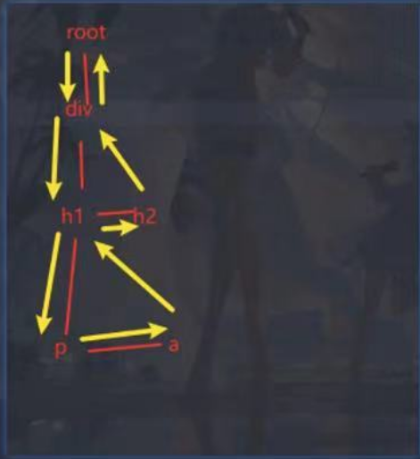

#### react 主要分为 3 部分

- Reconciler（协调器）：即 render 阶段，负责找出需要更新的节点，这个阶段是可以被中断的
- Renderer（渲染器）：即 commit 阶段，负责将变更的内容更新到 DOM 上，这个阶段是不可以中断的
- Scheduler（调度器）

### fiber

每个 fiber 节点都是一个工作单元，里面保存的信息主要包含 3 层

```js
// 作为静态数据结构的属性
key: diff算法的key
type: 节点类型
stateNode: 指向真实的DOM节点

// 用于连接其他Fiber节点形成Fiber树
return: 指向父Fiber节点
child: 指向第一个子Fiber节点
sibling: 指向下一个兄弟Fiber节点

// 作为动态的工作单元的属性,保存本次更新造成的状态改变相关信息
pendingProps: 当前最新的props
memoizedProps: 上一次的props
memoizedState: 上一次的state
updateQueue: 用于保存更新队列
effectTag: 副作用标识：'UPDATE'、'PLACEMENT'、'DELETION'...
lanes: 调度优先级相关
```

### fiber 中以下三个属性连接形成树

```js
// 指向父级Fiber节点
this.return = null;
// 指向子Fiber节点
this.child = null;
// 指向右边第一个兄弟Fiber节点
this.sibling = null;
```

例如以下的组件结构：

```js
function App() {
  return (
    <div>
      i am
      <span>KaSong</span>
    </div>
  );
}
```


### 双缓存技术

- 在 React 中最多会同时存在两棵 Fiber 树。

  - current Fiber 树：当前屏幕上显示内容对应的 Fiber 树。
  - workInProgress Fiber 树: 正在内存中构建的 Fiber 树。

- 两棵树之间通过 alternate 属性连接。

```js
currentFiber.alternate === workInProgressFiber;
workInProgressFiber.alternate === currentFiber;
```

- React 通过 current 指针指向当前渲染在页面上的 Fiber 树。当 workInProgress Fiber 树构建完成交给 Renderer 渲染在页面上后，应用根节点的 current 指针指向 workInProgress Fiber 树，此时 workInProgress Fiber 树就变为 current Fiber 树。

- 每次状态更新都会产生新的 workInProgress Fiber 树，通过 current 与 workInProgress 的比对，完成 DOM 更新。

### 各个阶段的工作


**<span style="color:red">render 阶段</span>**

render 阶段开始于 performSyncWorkOnRoot 或 performConcurrentWorkOnRoot 方法的调用。这取决于本次更新是同步更新还是异步更新。

```js
// workInProgress代表当前已创建的workInProgress fiber
// 在performUnitOfWork中，会创建下一个Fiber节点并赋值给workInProgress。

// performSyncWorkOnRoot会调用该方法
function workLoopSync() {
  while (workInProgress !== null) {
    performUnitOfWork(workInProgress);
  }
}

// performConcurrentWorkOnRoot会调用该方法（并发更新，异步）
function workLoopConcurrent() {
  while (workInProgress !== null && !shouldYield()) {
    performUnitOfWork(workInProgress);
  }
}
```

**performUnitOfWork**

- 从 rootFiber 开始向下进行深度优先遍历，为遍历到的每个 Fiber 节点调用 beginWork 方法（递）。

- 当遍历到叶子节点（即没有子组件的组件）时就会进入 "归" 阶段, 调用 completeWork 方法（归）。

- 某个 Fiber 节点执行完 completeWork，如果其存在兄弟 Fiber 节点（即 fiber.sibling !== null），会进入其兄弟 Fiber 的 "递" 阶段。

- 如果不存在兄弟 Fiber，会进入父级 Fiber 的 "归" 阶段。

- "递" 和 "归" 阶段会交错执行直到 "归" 到 rootFiber。至此，render 阶段的工作就结束了




---

**beginWork**

```js
function beginWork(
  current: Fiber | null,
  workInProgress: Fiber,
  renderLanes: Lanes
): Fiber | null {
  // update时：如果current存在可能存在优化路径，可以复用current（即上一次更新的Fiber节点）
  if (current !== null) {
    const oldProps = current.memoizedProps;
    const newProps = workInProgress.pendingProps;

    if (
      oldProps !== newProps ||
      hasLegacyContextChanged() ||
      (__DEV__ ? workInProgress.type !== current.type : false)
    ) {
      didReceiveUpdate = true;
    } else if (!includesSomeLane(renderLanes, updateLanes)) {
      didReceiveUpdate = false;
      switch (
        workInProgress.tag
        // 省略处理
      ) {
      }
      return bailoutOnAlreadyFinishedWork(current, workInProgress, renderLanes);
    } else {
      didReceiveUpdate = false;
    }
  } else {
    didReceiveUpdate = false;
  }

  // mount时：根据tag不同，创建不同的子Fiber节点
  switch (workInProgress.tag) {
    case IndeterminateComponent:
    // ...省略
    case LazyComponent:
    // ...省略
    case FunctionComponent:
    // ...省略
    case ClassComponent:
    // ...省略
    case HostRoot:
    // ...省略
    case HostComponent:
    // ...省略
    case HostText:
    // ...省略
    // ...省略其他类型
  }
}
```

- 首先会根据 current Fiber 是否存在，判断是初次渲染还是更新。如果是初次渲染，会调用 mount 方法，否则会调用 update 方法。

  - 更新，调用 update 方法

    - 在 update 方法里面，还会根据 current Fiber 与 workInProgress Fiber 的 props 是否相同，判断是否需要更新。如果不需要更新，会直接跳过子节点的遍历，进入 completeWork 阶段。

  - 初次更新/不满足优化策略，调用 mount 方法。
    - 根据 workInProgress Fiber 的 type，进入不同的方法创建 子 Fiber 逻辑。对于我们常见的组件类型，如（FunctionComponent/ClassComponent/HostComponent），最终会进入 reconcileChildren 方法。
      - mountChildFibers 和 reconcileChildFibers 的功能基本一致。区别是 reconcileChildFibers 会给创建的 fiber 节点打上 effectTag 标记，而 mountChildFibers 不会。

**reconcileChildren**

```ts
export function reconcileChildren(
  current: Fiber | null,
  workInProgress: Fiber,
  nextChildren: any,
  renderLanes: Lanes
) {
  if (current === null) {
    // 对于mount的组件
    workInProgress.child = mountChildFibers(
      workInProgress,
      null,
      nextChildren,
      renderLanes
    );
  } else {
    // 对于update的组件（Diff算法）
    workInProgress.child = reconcileChildFibers(
      workInProgress,
      current.child,
      nextChildren,
      renderLanes
    );
  }
}
```
---

**completeWork**

类似 beginWork，completeWork 也是针对不同 fiber.tag 调用不同的处理逻辑。在这个阶段给fiber.stateNode赋值，即真实的DOM节点。

```ts
function completeWork(
  current: Fiber | null,
  workInProgress: Fiber,
  renderLanes: Lanes
): Fiber | null {
  const newProps = workInProgress.pendingProps;

  switch (workInProgress.tag) {
    case IndeterminateComponent:
    case LazyComponent:
    case SimpleMemoComponent:
    case FunctionComponent:
    case ForwardRef:
    case Fragment:
    case Mode:
    case Profiler:
    case ContextConsumer:
    case MemoComponent:
      return null;
    case ClassComponent: {
      // ...省略
      return null;
    }
    case HostRoot: {
      // ...省略
      return null;
    }
    case HostComponent: {
      popHostContext(workInProgress);
      const rootContainerInstance = getRootHostContainer();
      const type = workInProgress.type;

      if (current !== null && workInProgress.stateNode != null) {
        /* 
        
          update的情况，在这一阶段处理props

        */
        updateHostComponent(
          current,
          workInProgress,
          type,
          newProps,
          rootContainerInstance
        );
      } else {
        /*
        
          mount的情况

        */
        const currentHostContext = getHostContext();
        // 为fiber创建对应DOM节点
        const instance = createInstance(
          type,
          newProps,
          rootContainerInstance,
          currentHostContext,
          workInProgress
        );
        // 将子孙DOM节点插入刚生成的DOM节点中
        appendAllChildren(instance, workInProgress, false, false);
        // DOM节点赋值给fiber.stateNode
        workInProgress.stateNode = instance;
      }
      return null;
    }
  }
}
```

**completeWork的update阶段**

在updateHostComponent内部，被处理完的props会被赋值给workInProgress.updateQueue，并最终会在commit阶段被渲染在页面上。

```ts
workInProgress.updateQueue = (updatePayload: any);
```


**completeWork的mount阶段**

completeWork中的appendAllChildren方法会将子孙DOM节点插入到刚生成的DOM节点中。那么“归”到rootFiber时，我们已经有一个构建好的离屏DOM树了。所以我们在mount阶段，只需给rootFiber的effectTag打上Placement标记，最终在commit阶段，将离屏DOM树插入到页面中即可。

---


### effectList

completeWork的上层函数**completeUnitOfWork**中，每个执行完completeWork且存在effectTag的Fiber节点会被保存在一条被称为effectList的单向链表中。最终形成rootFiber.firstEffect为起点的单向链表。

这样在commit阶段，我们就可以根据effectList的顺序，依次处理Fiber节点，而不需要重新遍历整棵树。
  
```
                       nextEffect         nextEffect
rootFiber.firstEffect -----------> fiber -----------> fiber
```


### render结束

至此，render阶段全部工作完成。在performSyncWorkOnRoot函数中fiberRootNode被传递给commitRoot方法，开启commit阶段工作流程。

```ts
function performSyncWorkOnRoot(root) {
  // ...省略
  commitRoot(root);
}
```
