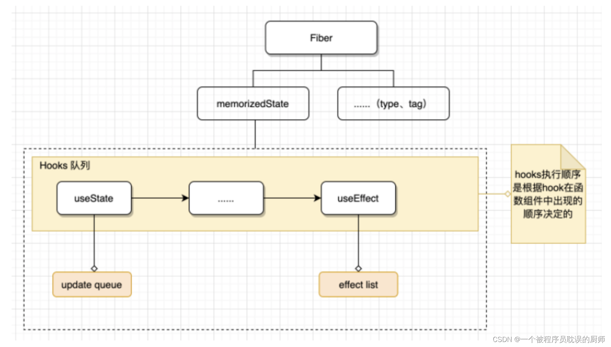

- <a href="#实现React Hooks">实现React Hooks</a>
  - <a href="#useReducer">useReducer</a>
  - <a href="#useState">useState</a>
  - <a href="#useMemo">useMemo</a>
  - <a href="#useCallback">useCallback</a>
  - <a href="#useEffect">useEffect</a>
  - <a href="#useLayoutEffect">useLayoutEffect</a>
  - <a href="#useRef">useRef</a>
  - <a href="#useImperativeHandle">useImperativeHandle</a>
  - <a href="#useContext">useContext</a>


**<a id="useState">useState</a> && <a id="useReducer">useReducer</a>**  

useState和useReducer使用方法
```js
const App = () => {
  const reducer = (state, action) => {
    switch(action.type) {
    case 'add':
      return state + 1;
    default:
      return state;
    }
  };
  const [number, setNumber] = useState(0);
  const [number1, dispatch] = useReducer(reducer, 0);
  const add = () => {
    // setNumber((n) => n + 1);
    setNumber(number + 1);
  };
  const add1 = () => {
    dispatch({ type: 'add' });
  };
  return (
    <div>
      <div>
        {number}
      </div>
      <button onClick={add}>+</button>
      <div>
        {number1}
      </div>
      <button onClick={add1}>+</button>
    </div>
  );
};
```

分析：  
useState和useReducer放在一起讲，是因为useState是对useReducer的简单调用。这里实现了useReducer另外一个也呼之欲出了。  

./react-dom.js
```js
// 新建全局数组，根据hook的hookIndex来存放每个hook的数据
let hookStates = [];
// 每次调用hook,hookIndex都会自增1，
let hookIndex = 0;
// 触发dom更新的方法
let scheduleUpdate;

export function useReducer(reducer, initialState) {
  // 如果有hookStates[hookIndex]没有值，说明不是初始化
  hookStates[hookIndex] = hookStates[hookIndex] || initialState;
  let currentIndex = hookIndex;
  function dispatch(action) {
    //1.获取老状态
    let oldState = hookStates[currentIndex];
    //如果有reducer就使用reducer计算新状态
    if (reducer) {
      let newState = reducer(oldState, action);
      hookStates[currentIndex] = newState;
    } else {
      // 没有reducer，说明这里就是useState的逻辑
      //判断action是不是函数，如果是传入老状态，计算新状态
      let newState = typeof action === 'function' ? action(oldState) : action;
      hookStates[currentIndex] = newState;
    }
    scheduleUpdate();
  }
  return [hookStates[hookIndex++], dispatch];
}

export function useState(initialState) {
  return useReducer(null, initialState);
}

function render(vnode, target, protal) {
  // 如果是非createProtal（表示render），清除目标dom的内容
  if (!protal) {
    target.innerHTML = '';
  }
  mount(vnode, target);

  scheduleUpdate = ()=>{
    hookIndex = 0;
    twoVnode(target,vnode,vnode);
  };
}
```

---

**<a id="useMemo">useMemo</a> && <a id="useCallback">useCallback</a>**  

分析：  
这里主要是判断依赖的数组里面的数据，是否和上一次的相同。如果不同，则获取最新的传入数据，放进对应的hookStates里面。

```js
export function useMemo(factory,deps){
  if(hookStates[hookIndex]){
    let [lastMemo,lastDeps] = hookStates[hookIndex];
    // 判断数组里面的每一项是否和上一次的相同
    let same = deps.every((item,index)=>item === lastDeps[index]);
    if(same){
      hookIndex++;
      return lastMemo;
    }else{
      let newMemo = factory();
      hookStates[hookIndex++]=[newMemo,deps];
      return newMemo;
    }
  }else{
    let newMemo = factory();
    hookStates[hookIndex++]=[newMemo,deps];
    return newMemo;
  }
}
export function useCallback(callback,deps){
  if(hookStates[hookIndex]){
    let [lastCallback,lastDeps] = hookStates[hookIndex];
    let same = deps.every((item,index)=>item === lastDeps[index]);
    if(same){
      hookIndex++;
      return lastCallback;
    }else{
      hookStates[hookIndex++]=[callback,deps];
      return callback;
    }
  }else{
    hookStates[hookIndex++]=[callback,deps];
    return callback;
  }
}
```

**<a id="useEffect">useEffect</a>**

```js
export function useEffect(callback, deps) {
  let currentIndex = hookIndex;
  if (hookStates[hookIndex]) {
    let [destroy, lastDeps] = hookStates[hookIndex];
    let same = deps && deps.every((item, index) => item === lastDeps[index]);
    if (same) {
      hookIndex++;
    } else {
      destroy && destroy();
      setTimeout(() => {
        hookStates[currentIndex] = [callback(), deps];
      });
      hookIndex++;
    }
  } else {
    setTimeout(() => {
      hookStates[currentIndex] = [callback(), deps];
    });

    hookIndex++;
  }
}
```


**<a id="useLayoutEffect">useLayoutEffect</a>**

```js
export function useLayoutEffect(callback,dependencies){
  let currentIndex = hookIndex;
  if(hookStates[hookIndex]){
    let [destroy,lastDeps] = hookStates[hookIndex];
    let same = dependencies&&dependencies.every((item,index)=>item === lastDeps[index]);
    if(same){
      hookIndex++;
    }else{
      destroy&&destroy();
      hookStates[currentIndex]=[callback(),dependencies];
      hookIndex++;
    }
  }else{
    hookStates[currentIndex]=[callback(),dependencies];
    hookIndex++;
  }
}
```


**<a id="useRef">useRef</a>**

```js
export function useRef(initialState) {
  hookStates[hookIndex] =  hookStates[hookIndex] || { current: initialState };
  return hookStates[hookIndex++];
}
```


**<a id="useImperativeHandle">useImperativeHandle</a>**

```js
export function useImperativeHandle(ref, factory) {
  return ref.current = factory();
}
```


**<a id="useContext">useContext</a>**

```js
export function useContext(context) {
  return context._currentValue;
}
```


知识点：  

1）useState的原理是什么。
```js
// 链表
{
    baseQueue: null,     // 当前 update
    baseState: 'hook1',  // 初始值，即 useState 入参
    memoizedState: null, // 当前状态（更新时表示上一次的状态）
    queue: null,         // 待执行的更新队列(queue.pending)
    next: {              // 下一个 hook
        baseQueue: null,
        baseState: null,
        memoizedState: 'hook2',
        next: null
        queue: null
    }
}
```


**在mount**
react根据hooks的执行顺序，创建一个记录hooks的单向链表，存放在fiber节点的memorizedState属性上。
在链表中每个hook都对应一个hook对象。对象里面主要有3个属性：
- memoizedState：当前状态（更新时表示上一次的状态）
- queue：待执行的更新队列(queue.pending)，这是一个单向循环链表，每个节点都是一个update对象。
- next：下一个 hook


**在update阶段**
- 会根据链表的顺序，依次执行每个hook的update函数，更新hook的memoizedState属性。
- queue存储的是待执行的更新队列，每次执行完update函数后，会把queue.pending置为null，表示已经执行完了。

---


根据hook的执行顺序，就能根据链表拿到对应的值。因此为了保持hooks顺序的一致性，我们禁止把hooks放在各种条件语句中运行，因为可能导致hooks的顺序错乱。  

useEffect在react18的严格模式下会执行2次（完成了2次组件安装，也就是有组件卸载的过程），是因为后续react新增的功能做好准备（允许 React 在保留状态的同时，能够做到仅仅对UI部分的添加和删除）