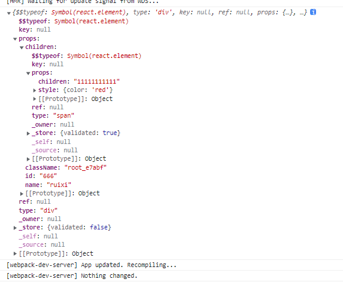
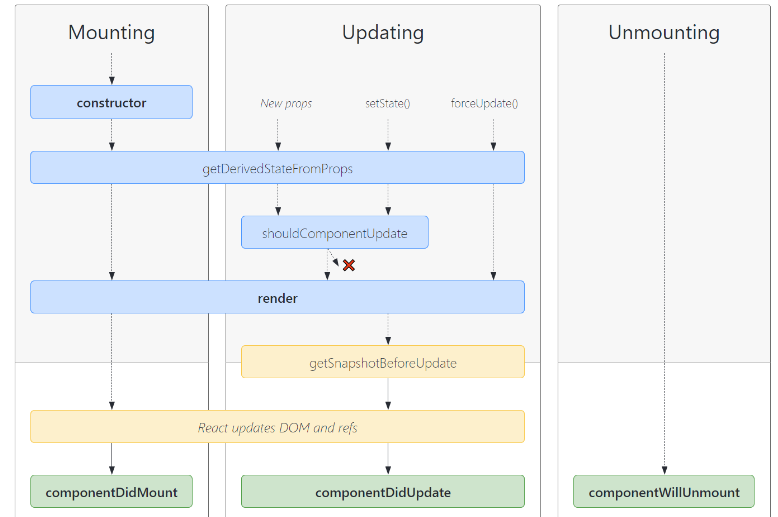

**从0实现react17**

- <a href="#了解babel对jsx转换后的结构">了解babel对jsx转换后的结构</a>
- <a href="#实现React.createElement">实现React.createElement</a>
- <a href="#实现ReactDOM.render">实现ReactDOM.render</a>
- <a href="#渲染Class组件">渲染Class组件</a>
- <a href="#渲染函数组件">渲染函数组件</a>
- <a href="#实现合成事件和合成事件对象">实现合成事件和合成事件对象</a>
- <a href="#实现class组件的this.setState更新">实现class组件的this.setState更新</a>
- <a href="#实现ref获取dom、函数实例">实现ref获取dom、函数实例</a>
- <a href="#实现React的生命周期">实现React的生命周期</a>
  - <a href="#componentWillMount">componentWillMount（17之后被废弃）</a>
  - <a href="#componentDidMount">componentDidMount</a>
  - <a href="#shouldComponentUpdate">shouldComponentUpdate</a>
  - <a href="#componentWillUpdate">componentWillUpdate（17之后被废弃）</a>
  - <a href="#componentDidUpdate">componentDidUpdate</a>
  - <a href="#componentWillReceiveProps">componentWillReceiveProps（17之后被废弃）</a>
  - <a href="#componentWillUnmount">componentWillUnmount</a>
  - <a href="#getDerivedStateFromProps">getDerivedStateFromProps</a>
  - <a href="#getSnapshotBeforeUpdate">getSnapshotBeforeUpdate</a>
- <a href="#diff算法">diff算法</a>
- <a href="#实现React.createContext">实现React.createContext</a>
- <a href="#实现React.cloneElement">实现React.cloneElement</a>
- <a href="#实现ReactDOM.createPortal">实现ReactDOM.createPortal</a>
- <a href="#实现React.PureComponent">实现React.PureComponent</a>
- <a href="#实现React.memo">实现React.memo</a>


**<a id="了解babel对jsx转换后的结构">了解babel对jsx转换后的结构</a>**

在现代化项目中，我们引入react相关的babel之后，相应的babel会对jsx进行转化，利用下面的jsx最终被转化为对React.createElement的调用。
```js
<div name="ruixi" id="666" className={styles.root}>
  <span style={{ color: 'red' }}>
      11111111111
  </span>
</div>

⬇⬇⬇
/*#__PURE__*/React.createElement("div", {
  name: "ruixi",
  id: "666",
  className: styles.root
}, /*#__PURE__*/React.createElement("span", {
  style: {
    color: 'red'
  }
}, "11111111111"));

```
React.createElement最终生成下面结构的虚拟dom  

  

***

**<a id="实现React.createElement">实现React.createElement</a>**

./constant.js
```js
const REACT_ELEMENT = Symbol('react.element');

const REACT_TEXT = Symbol('react.text');

const REACT_FRABMENT = Symbol('react.fragment');

const REACT_FORWARD_REF = Symbol('react.forward_ref');

export {
  REACT_ELEMENT,
  REACT_TEXT,
  REACT_FRABMENT,
  REACT_FORWARD_REF
};
```

./react.js
```js
import { REACT_ELEMENT, REACT_FRABMENT, REACT_TEXT } from "./constant";

// 把基本数据类型转换为对象形式，统一为text类型。方便后续对类型的判断。
// 基础数据类型，除了number和string，其他的内容统一设置为''(空)，这样在创建空白文本片段时，不会出现内容
export function changeVnode(vnode) {
  if (typeof vnode !== 'object') {
    if (typeof vnode === 'string' || typeof vnode === 'number' ) {
      return {
        type: REACT_TEXT,
        content: vnode,
        props: {}
      };
    }
    return {
      type: REACT_TEXT,
      content: '',
      props: {}
    };
  }

  return vnode;
}

function createElement(type, config, ...children) {
  const { key = null, ref = null } = config || {};
  // 拿到key和ref之后，删除config上的属性
  key && Reflect.deleteProperty(config, 'key');
  ref && Reflect.deleteProperty(config, 'ref');

  const props = {
    ...config,
  };

  // 处理children
  if (children.length === 1) {
    props.children = changeVnode(children[0]);
  } else if (children.length > 1) {
    props.children = children.map(i => changeVnode(i));
  }
  
  return {
    $$typeof: REACT_ELEMENT,
    props,
    ref,
    key,
    type,
  };
}

const React = {
  createElement,
  /**
   *空白元素标识
    如果我们在jsx里面使用<></>，babel会把这个结果解析为
    React.createElement(React.Fragment, {})
   */
  Fragment: REACT_FRABMENT,
};

export default React;
```

***

**<a id="实现ReactDOM.render">实现ReactDOM.render</a>**  

./react-dom.js
```js
import { REACT_FRABMENT, REACT_TEXT } from "./constant";
import { changeVnode } from './react';

const ReactDOM = {
  render,
};
function render(vnode, target, protal) {
  // 如果是非createProtal（表示render），清除目标dom的内容
  if (!protal) {
    target.innerHTML = '';
  }
  mount(vnode, target);
}
function mount(vnode, target) {
  const dom = createDom(vnode);
  target.appendChild(dom);
}

function createDom(vnode) {
  // 将数字和字符串转化为对象描述的元素
  vnode = changeVnode(vnode);

  const { type, props } = vnode;

  let dom;
  if (vnode.type === REACT_TEXT) {
    // 普通文本
    dom = document.createTextNode(vnode.content);
  } else if (type === REACT_FRABMENT) {
    // 空白元素
    dom = document.createDocumentFragment();
  } else {
    // 普通元素
    dom = document.createElement(type);
  }
    
  // 对props进行设置
  updateProps(dom, {}, props);
  // 处理children
  changeChildren(props.children, dom);
  return dom;
}

function updateProps(dom, oldProps, newProps) {
  // 这里需要注意的点是，children是放在专门处理children的函数的，所以在循环props是遇到children要跳过
  const { style, ...other } = newProps;
  // 设置styles
  if (style) {
    Object.keys(style).forEach(key => {
      dom.style[key] = style[key];
    });
  }
  // 给dom添加新的属性
  Object.keys(other).forEach(key => {
    if (key === 'children') return;
    dom[key] = other[key];
  });
  // 如果老的属性，在新的上没有，那么则把属性删除
  Object.keys(oldProps).forEach(key => {
    if (key === 'children') return;
    if (!newProps[key]) {
      dom[key] = null;
    }
  });
}

// 处理children
function changeChildren(children, target) {
  if (Array.isArray(children)) {
    // 这里数组扁平化是因为如果在jsx中
    /**
     * 出现这样（数组） {[1, 2, 3]}
     * 他会归为一个children，但是这个children又有3个子项。（可以多层嵌套）
    */
    children = children.flat(Infinity);
    children.forEach(child => mount(child, target));
  } else if (children !== undefined && children !== null) {
    mount(children, target);
  }
}

export default ReactDOM;
```

***

**<a id="渲染Class组件">渲染Class组件</a>**  

我们先看看class组件在babel转化之后的结构：这里的type变成了ClassComponent函数
```js
class ClassComponent extends React.Component {
  constructor(props){
    super(props);
  }
  render() {
    return(
      <div>
        {this.props.name}
      </div>
    );
  }
}

<div>
  <ClassComponent name="你好" />
</div>

⬇⬇⬇
/*#__PURE__*/React.createElement("div", null, /*#__PURE__*/React.createElement(ClassComponent, {
  name: "\u4F60\u597D"
}));
// 注意这里class组件，在createElement函数里面，type变成了function

```

**实现React.Component**  
./react.js
```js
import { Component } from './component';
...
const React = {
  createElement,
  Component
};
```

./component.js
```js
class Component {
  // 子类可以继承父类的实例方法、静态方法、原型方法。
  // 设置这个静态属性，是为了判断该函数是继承于React.Component
  static isClassComponent = true;
  constructor(props) {
    this.props = props;
    this.state = {};
  }
}

export {
  Component
};
```

./react-dom.js
```js
function createDom(vnode) {
  ...
  const { type } = vnode;

  // class实例上由父类的静态属性，说明是继承自React.Component
  // type变成了function
  if (type.isClassComponent) {
    return mountClassComponent(vnode);
  }
  
  let dom;
  ...
  return dom;
}

function mountClassComponent(vnode) {
  const { type, props } = vnode;
  // type是class类，传入props，new获取它的实例
  const instance = new type(props);

  // 获取到class组件的虚拟dom
  const classVnode = instance.render();
  // 根据render后得到的普通元素的vnode，调用createDom获取真实dom
  const dom = createDom(classVnode);

  return dom;
}
```

***

**<a id="渲染函数组件">渲染函数组件</a>**  

函数组件的jsx转换和class组件一样，我们只需要在createDom方法里面进行区分，然后进行不同的逻辑渲染。

./react-dom.js
```js
function createDom(vnode) {
  ...
  const { type, $$typeof } = vnode;

  if (type.isClassComponent) {
    return mountClassComponent(vnode);
  }

  // function组件(放在class函数渲染后面，这样函数组件，排除了class就是function组件了)
  if (typeof type === 'function') {
    return mountFunctionComponent(vnode);
  }

  let dom;
  ...
  return dom;
}
//处理函数式组件
function mountFunctionComponent(vnode) {
  // 此时的vnode是数式组件的vnode
  const { type, props } = vnode;
  const functionVnode = type(props);
  // 给vnode也挂载oldVnode
  vnode.oldReaderVnode = functionVnode;

  // 通过原生组件生成真实dom
  const dom = createDom(functionVnode);
  return dom;
}
```

***

**<a id="实现合成事件和合成事件对象">实现合成事件和合成事件对象</a>**
在我们设置事件时，需要在处理props时，对我们的事件进行设置

./react-dom.js
```js
import { addEvent } from './addEvent.js';
function updateProps(dom, oldProps, newProps) {
  const { style, ...other } = newProps;
  if (style) {
    Object.keys(style).forEach(key => {
      dom.style[key] = style[key];
    });
  }
  Object.keys(other).forEach(key => {
    if (key === 'children') return;
    // 以on开头的都是事件
    if (key.startsWith('on')) {
      // 设置合成事件
      addEvent(dom, key.toLocaleLowerCase(), other[key]);
    } else {
      dom[key] = other[key];
    }
  });
  Object.keys(oldProps).forEach(key => {
    if (key === 'children') return;
    if (!newProps[key]) {
      dom[key] = null;
    }
  });
}
```

./addEvent.js
```js
/**
 * 利用事件委托，把所有事件放在document上处理
 * @param {*} dom 产生事件的dom
 * @param {*} eventType 事件类型
 * @param {*} handler 事件函数
 */

export default function addEvent(dom, eventType, handler) {
  // 在触发事件的dom上，设置一个store，放置它自身的事件函数。
  const store = dom.store || (dom.store = {});
  store[eventType] = handler;
  // 把事件放在document上处理
  document[eventType] = dispatchEvent;
}

function dispatchEvent(e) {
  const { type, target } = e;
  const eventType = `on${type}`;
  // 事件委托，利用事件冒泡
  const { store } = target;
  const handler = store && store[eventType];

  const event = createBaseEvent(e);
  // 生成合成事件
  handler && handler(event);
}

// 这里创建一个新的事件对象，是为了处理一些兼容性问题。
function createBaseEvent(nativeEvent) {
  let syntheticBaseEvent = {};
  for (let key in nativeEvent) {
    syntheticBaseEvent[key] = nativeEvent[key];
  }
  // nativeEvent放置原生的事件
  syntheticBaseEvent.nativeEvent = nativeEvent;
  // 处理preventDefault的兼容性问题
  syntheticBaseEvent.preventDefault = preventDefault;
  return syntheticBaseEvent;
}

function preventDefault(e) {
  // ie
  if (!e) {
    window.event.returnValue = false;
  }
  if (e.preventDefault) {
    e.preventDefault();
  }
}
```

***

**<a id="实现class组件的this.setState更新">实现class组件的this.setState更新</a>** 

```js
import React from '../react/react.js';
import ReactDOM from '../react/react-dom';

class ClassComponent extends React.Component {
  constructor(props){
    super(props);
    this.state = {
      number: 0,
    };
  }

  addNumber = (e) => {
    this.setState({ number: this.state.number + 1 });
    this.setState({ number: this.state.number + 1 });
    this.setState({ number: this.state.number + 1 });
  };

  render() {
    return(
      <div>
        <div>
          {this.state.number}
        </div>
        <button onClick={this.addNumber}>+</button>
      </div>
    );
  }
}

ReactDOM.render(<ClassComponent name="你好" />, document.querySelector('#app'));
```

./component.js
```js
import { twoVnode } from './react-dom';
import { shouldUpdate } from './component';

export const updateQueue = {
  isBatchData: false, // 表示是否收集依赖之后再更新
  updaters: [],
  batchUpdate() {
    updateQueue.updaters.forEach(updater => updater.updateComponent());
    // 更新完成之后，变回false
    updateQueue.isBatchData = false;
    updateQueue.updaters.length = 0;
  }
};

class Updater {
  // 传入classInstance
  constructor(classInstance) {
    this.classInstance = classInstance;
    // 需要更新的数据列表
    this.pendingState = [];
  }
  // 添加数据
  addState(partialData) {
    this.pendingState.push(partialData);
    // 通知更新数据
    this.emitUpdate();
  }
  emitUpdate() {
    // 在执行this.setState事件前，isBatchData已经设置为true。那么就会把更新器收集到数组里面
    if (updateQueue.isBatchData) { // 异步
      updateQueue.updaters.push(this);
    } else {
      // 更新组件
      this.updateComponent();
    }
  }
  // 更新组件
  updateComponent() {
    const { pendingState, classInstance } = this;
    // 获取数据 => 更新组件
    if (pendingState.length > 0) {
      shouldUpdate(classInstance, this.getState());
    }
  }
  // 获取最新的state
  getState() {
    const { pendingState, classInstance } = this;
    // 更新前的state
    let { state } = classInstance;
    // 合并成新的state
    pendingState.forEach(nextState => {
      state = { ...state, ...nextState };
    });
    // 清空数据
    pendingState.length = 0;
    return state;
  }
}

function shouldUpdate(classInstance, newState) {
  // 把最新的state放在实例的state。
  classInstance.state = newState;
  shouldUpdate(classInstance, classInstance.state);
}


class Component {
  // 子类可以继承父类的实例方法、静态方法、原型方法
  static isClassComponent = true;
  constructor(props) {
    this.props = props;
    this.state = {};
    // 更新器，传入this，方便我们在更新器里面调用实例方法。
    this.updater = new Updater(this);
  }
  // 子类继承setState方法。
  setState(partialData) {
    // 把更新的数据，放在一个需要更新的数组里面
    this.updater.addState(partialData);
  }
  forceUpdate() {
    // 此时已经拿到最新的state，所以render的返回结果是最新的vnode
    const newVnode = this.render();
    // 在./react-dom.js 触发mountClassComponent时，已经给class实例挂载上自身的render后得到vnode（旧的）
    // 和给vnode挂载了当时的dom
    const oldVnode = this.oldVnode;
    const oldDom = oldVnode.dom;
  
    const parentDom = oldDom.parentNode;
    twoVnode(parentDom, oldVnode, newVnode);
  }
}

export {
  Component
};
```

./react-dom.js
```js
function createDom(vnode) {
  ...
  // 到了这里的vnode,都只是普通的原生组件。
  //因为FunctionComponent合ClassComponent的vnode已经被它们各自的函数消费了
  vnode.dom = dom; //保存真实dom
  return dom;
}

function mountClassComponent(vnode) {
  const { type, props } = vnode;
  // type是class类，new获取它的实例
  const instance = new type(props);

  // 获取到class原生组件的vnode
  const classVnode = instance.render();

  // 实例挂载它自身的原生组件，命名为oldReaderVnode
  instance.oldReaderVnode = classVnode;
  // 给类组件的vnode挂载它自身的原生组件，命名为oldReaderVnode
  vnode.oldReaderVnode = classVnode;
  // 给类组件的vnode挂载它自身的实例，命名为classInstance
  vnode.classInstance = instance;
  
  // 通过原生组件生成真实dom
  const dom = createDom(classVnode);

  return dom;
}

function twoVnode(parentDom, oldVnode, newVnode) {
  // 这时候调用createDom生成新的真实dom,同时createDom函数会将真实的dom，挂载到newVnode上。
  const newDom = createDom(newVnode);
  parentDom.replaceChild(newDom, oldVnode.dom);
  return;
}

function findDOM(vnode) {
  if (!vnode) return null;
  //说明这个vnode是一个原生组件的虚拟dom，他会有dom属性指向真实的dom
  if (vnode.dom) return vnode.dom;
  //如果vnode没有dom属性，那说明这个vnode是一个class或者function的vnode，它会有oldReaderVnode，指向它内部获取到的原生组件的虚拟dom
  return findDOM(vnode.oldReaderVnode);
}

export {
  twoVnode,
  findDOM
};
```


./addEvent.js
```js
import { updateQueue } from "./component";

  // 生成合成事件
function dispatchEvent(e) {
  ...
  // 在执行事件前，isBatchData设置为true。那么就会把更新器收集到数组里面
  updateQueue.isBatchData = true;
  handler && handler(event);
  // 触发更新（因为是在事件执行之后触发的更新，所以无法获取最新的dom）
  updateQueue.batchUpdate();
}
```

***

**<a id="实现ref获取dom、函数实例">实现ref获取dom、函数实例</a>**  

./react.js
```js
function createRef() {
  return {
    current: null
  };
}

const React = {
  ...
  createRef,
};
```

- 普通元素获取dom

./react-dom.js
```js
function createDom(vnode) {
  ...
  const { type, props, ref } = vnode;
  ...
  // 原生组件，如果有ref，那就把dom赋值给它
  if (ref) ref.current = dom;
  return dom;
}
```

- 获取函数组件实例

./react-dom.js
```js
function mountClassComponent(vnode) {
  const { type, props, ref } = vnode;
  // type是class类，new获取它的实例
  const instance = new type(props);
  // 给ref挂载实例
  if (ref) ref.current = instance;
  ...
  return dom;
}

```

- 函数组件传递ref

./react.js
```js
import { REACT_ELEMENT, REACT_FRABMENT, REACT_FORWARD_REF } from "./constant";
function forwardRef(render) {
  return {
    $$typeof: REACT_FORWARD_REF,
    render,
  };
}

const React = {
  forwardRef
};
```

./react-dom.js
```js
function createDom(vnode) {
  ...
  const { type, props, ref } = vnode;
  ...
    // forward组件
  if (type && type.$$typeof === REACT_FORWARD_REF) {
    return mountForwardComponent(vnode);
  }
  ...
  return dom;
}
// 这里把ref以参数的形式传入了function组件中
function mountForwardComponent(vnode) {
  const { type, props, ref } = vnode;
  const functionVnode = type.render(props, ref);
  return createDom(functionVnode);
}
```


---

**<a id="实现React的生命周期">实现React的生命周期</a>**  


**<a id="componentWillMount">componentWillMount</a>**

./react-dom.js
```js
//处理类组件
function mountClassComponent(vnode) {
  ...
  // 判断如果有componentWillMount,在完成createDom之前执行
  if (instance.componentWillMount) {
    instance.componentWillMount();
  }
  // 通过原生组件生成真实dom
  const dom = createDom(classVnode);
  ...  
  return dom;
}
```


**<a id="componentDidMount">componentDidMount</a>**

./react-dom.js
```js
//处理类组件
function mountClassComponent(vnode) {
  ...
  // 通过原生组件生成真实dom
  const dom = createDom(classVnode);
  // 把componentDidMount挂载到dom上
  if (instance.componentDidMount) {
    dom.componentDidMount = instance.componentDidMount.bind(instance);
  }
  ...  
  return dom;
}

function mount(vnode, target) {
  const dom = createDom(vnode);
  target.appendChild(dom);
  // 组件完成挂载的时候执行
  if (dom.componentDidMount) dom.componentDidMount();
}
```


**<a id="shouldComponentUpdate">shouldComponentUpdate</a>**  
**<a id="componentWillUpdate">componentWillUpdate</a>**
```js

function shouldUpdate(classInstance, newState) {
  // 声明willUpdate为true，根据此变量，判断是否更新。
  let willUpdate = true;
  if (classInstance.shouldComponentUpdate) {
    // shouldComponentUpdate的返回值决定是否更新视图
    willUpdate = classInstance.shouldComponentUpdate(classInstance.props, newState);
  }
  
  classInstance.state = newState;

  if (!willUpdate) return;
  // 只forceUpdate之前，触发componentWillUpdate。
  classInstance.componentWillUpdate && classInstance.componentWillUpdate();
  
  classInstance.forceUpdate();
}
```


**<a id="componentDidUpdate">componentDidUpdate</a>**

因为他是在数据改变之后触发的，所以在dom更新完成之后触发
./component.js
```js
  forceUpdate() {
    ...
    twoVnode(oldDom.parentNode, oldVnode, newVnode);
    // 渲染之后，oldReaderVnode（旧的vnode）就变成了newVnode；
    this.oldReaderVnode = newVnode;
    // 触发生命周期
    this.componentDidUpdate && this.componentDidUpdate(this.props, this.state);
  }
```


**<a id="getDerivedStateFromProps">getDerivedStateFromProps</a>**  
**<a id="getSnapshotBeforeUpdate">getSnapshotBeforeUpdate</a>**

getDerivedStateFromProps在Mounting和Updateing阶段都会执行。
./react-dom.js
```js
//处理类组件
function mountClassComponent(vnode) {

  // 此时的vnode是类组件的vnode
  const { type, props, ref } = vnode;

  // type是class类，new获取它的实例
  const instance = new type(props);
  // 静态属性getDerivedStateFromProps的作用是在渲染前，传入它的props和state，函数的返回值会合并到this.state
  if(instance.constructor.getDerivedStateFromProps){
    let newState = instance.constructor.getDerivedStateFromProps(instance.props, instance.state);
    if (newState) {
      instance.state = {...instance.state, ...newState};
    }
  }
  ...
}
```
./component.js
```js
  forceUpdate() {

    // 因为挂载发生在上一次的渲染阶段，而这次是forceUpdate。所有上次挂载的oldReaderVnode就属于旧的vnode（也就是它的render后的原生组件的vnode）
    const oldVnode = this.oldReaderVnode;
    // 因为我们给
    const oldDom = findDOM(oldVnode);
    // 静态属性getDerivedStateFromProps的作用是在渲染前，传入它的props和state，函数的返回值会合并到this.state
    if(this.constructor.getDerivedStateFromProps){
      let newState = this.constructor.getDerivedStateFromProps(this.props, this.state);
      if (newState) {
        this.state = {...this.state, ...newState};
      }
    }
    // getSnapshotBeforeUpdate会在渲染之前执行，所以此时能拿到渲染前的dom，它的返回值，会传入componentDidUpdate
    let snapshot = this.getSnapshotBeforeUpdate && this.getSnapshotBeforeUpdate();

    const newVnode = this.render();
    twoVnode(oldDom.parentNode, oldVnode, newVnode);

    // 渲染之后，oldReaderVnode（旧的vnode）就变成了newVnode；
    this.oldReaderVnode = newVnode;
 
    // 触发生命周期
    this.componentDidUpdate && this.componentDidUpdate(this.props, this.state, snapshot);
  }
```

**以下3个生命周期在react17被废弃**  
**<a id="componentWillMount">componentWillMount（在react17被废弃）</a>**  
**<a id="componentWillReceiveProps">componentWillReceiveProps（在react17被废弃）</a>**  
**<a id="componentWillUpdate">componentWillUpdate（在react17被废弃）</a>**


---


**<a id="diff算法">diff算法</a>**  

在组件的更新函数里面，我们简单暴力的替换新老dom，显然是不合理的。
```js
function twoVnode(parentDom, oldVnode, newVnode) {
  // 这时候调用createDom生成新的真实dom,同时createDom函数会将真实的dom，挂载到newVnode上。
  const newDom = createDom(newVnode);
  parentDom.replaceChild(newDom, findDOM(oldVnode));
  return;
}
```

分析：  

前置条件：我们在twoVnode函数添加nextDom参数，表示新的dom的位置
```js
function twoVnode(parentDom, oldVnode, newVnode, nextDom){}
```

1、react替换dom是从根节点开始的，只进行同级比较，通过递归往下遍历。比较同级节点时，有以下几种情况  
  1）如果新、旧的newVnode都不存在，则什么都不操作。直接return；  
  2）如果新的newVnode存在，旧的不存在，则往父节点添加新的dom。  
  3）如果新、旧vnode都存在，则判断它们的类型是否相同。  
    ①：相同：进行dom更新操作。  
    ②：不相同：把旧的dom删除，添加新的dom。  

```js
function twoVnode(parentDom, oldVnode, newVnode, nextDom) {
  // 这时候调用createDom生成新的真实dom,同时createDom函数会将真实的dom，挂载到newVnode上。
  // const newDom = createDom(newVnode);
  // parentDom.replaceChild(newDom, findDOM(oldVnode));
  // return;
  if (!oldVnode && !newVnode) return;
  // 如果老的有，新的没有，直接删除
  if (oldVnode && !newVnode) {
    unMountVnode(oldVnode);//删除老的
    return;
  }

  // 如果老的没有，新的有。直接添加
  if (!oldVnode && newVnode) {
    let newDom = createDom(newVnode);
    if (nextDom) { // 判断有没有需要插入的位置
      parentDom.insertBefore(newDom, nextDom);
    } else {
      parentDom.appendChild(newDom);
    }
    // 组件完成挂载的时候执行
    if (newDom.componentDidMount) newDom.componentDidMount();
    return;
  }

  // 这里表示两个都有 =》 判断两个类型type，如果类型一样，可以复用。类型不一样，不能复用
  if (oldVnode && newVnode && oldVnode.type !== newVnode.type) {
    mountVdom(parentDom, newVnode, nextDom);
    // old: div   new: span
    unMountVnode(oldVnode);
    
    return;
  }
  // 这里表示两个都有，进行dom更新
  updateElement(oldVnode, newVnode);
}
```

- **<a id="componentWillUnmount">unMountVnode函数（卸载dom）&& componentWillUnmount</a>**  
**这里主要执行的是把之前的ref属性清空,在react17之前，还会执行componentWillUnmount生命周期。**
```js
function unMountVnode(oldVnode) {
  let { props, ref } = oldVnode;
  let currentDOM = findDOM(oldVnode);
  // 如果是class实例，那么执行它的componentWillUnmount方法
  if (oldVnode.type?.isClassComponent) {
    const classInstance = new oldVnode.type(props);
    classInstance.componentWillUnmount &&classInstance.componentWillUnmount();
  }
  // 如果之前是有挂载ref的（class组件时挂载自身的实例），那么清空该ref
  if (ref) {
    ref.current = null;
  }
  // 如果时class/function组件，就通过oldReaderVnode获取原生组件的vnode
  if (oldVnode.oldReaderVnode?.props?.children) {
    let children = oldVnode.oldReaderVnode?.props?.children;
    children = Array.isArray(children) ? children : [children].filter(i => i);
    // 递归
    children.forEach(unMountVnode);
  }
  // 原生组件直接获取children
  if (props?.children) {
    let children = Array.isArray(props.children) ? props.children : [props.children];
    // 递归
    children.forEach(unMountVnode);
  }

  // 删除元素
  if (currentDOM) {
    currentDOM.remove();
  }
}
```

- **mountVdom（挂载dom）**  
**这里主要执行的是dom插入，并且插入之后，执行componentDidMount生命周期**
```js
function mountVdom(parentDom, newVnode, nextDom) {
  let newDom = createDom(newVnode);
  if (nextDom) { // 判断有没有需要插入的位置
    parentDom.insertBefore(newDom, nextDom);
  } else {
    parentDom.appendChild(newDom);
  }
  // 组件完成挂载的时候执行
  if (newDom.componentDidMount) newDom.componentDidMount();
}
```

- **updateElement（元素更新）**  

分析：  
两个vnode的type相同，我们还需要区分以下几种情况。不同类型要执行不同的操作  
1、都是文本类型：只更新文本就行了。
2、都是原生组件：需要更新组件，而且子组件也需要更新。
3、class组件，进行class组件更新的函数
4、function组件，进行function组件更新

```js
function updateElement(oldVnode, newVnode) {

  // 文本节点
  if (oldVnode.type === REACT_TEXT && newVnode.type === REACT_TEXT) {
    // 复用老的文本节点
    let currentDom = newVnode.dom = findDOM(oldVnode);
    // 如果文本相同，那就不更新了
    if (oldVnode.content === newVnode.content) return;
    // 获取最新的文本内容
    currentDom.textContent = newVnode.content;
    return;
  }

  // 原生组件
  if (typeof oldVnode.type === 'string' || oldVnode.type === REACT_FRABMENT) {
    // 复用老的dom节点
    let currentDom = newVnode.dom = findDOM(oldVnode);
    // 更新属性
    updateProps(currentDom, oldVnode.props, newVnode.props);
    // 更新children
    updateChildren(currentDom, oldVnode.props.children, newVnode.props.children);
    return;
  }

  // 类组件
  if (typeof oldVnode.type === 'function' && oldVnode.type.isClassComponent) {
    // 更新类组件
    updateClassComponent(oldVnode, newVnode);
    return;
  }

  // 剩下的就是函数组件=>更新函数组件
  updateFunctionComponent(oldVnode, newVnode);
}
```

 - **updateClassComponent（更新class组件）**  
 这里主要是让更新实例的props，然后执行实例的forceUpdate（递归更新class组件里面的组件）。旧版本的react也是在这里执行componentWillReceiveProps生命周期。
```js
// 更新类组件
function updateClassComponent(oldVnode, newVnode) {
  // 复用老的实例
  let classInstance = newVnode.classInstance = oldVnode.classInstance;
  // 复用老的vnode，为了后续能拿到真实dom
  newVnode.oldReaderVnode = oldVnode.oldReaderVnode;
  // 注意在这里需要判断一下 是否需要 就收更新组件的数据
  if (classInstance.componentWillReceiveProps) {
    classInstance.componentWillReceiveProps(newVnode.props);
  }
  // 更新props =>  类组件强制更新
  classInstance.props = newVnode.props;
  shouldUpdate(classInstance, classInstance.state);
}
```

 - **updateFunctionComponent（更新function组件）**  
 这里主要是获取两个新老function vnode的原生vnode，然后交给twoVnode函数进行diff
```js
//更新函数组件
//更新函数组件
function updateFunctionComponent(oldVnode, newVnode) {
  let parentDom = findDOM(oldVnode).parentNode;// 获取老的真实dom的父节点
  let { type, props } = newVnode;
  let newRenderVdom = type(props); //获取到新的组件的vnode
  twoVnode(parentDom, oldVnode.oldReaderVnode, newRenderVdom);
  // 设置oldReaderVnode，为了后续能拿到真实dom（此时的newRenderVdom经过twoVnode函数，newRenderVdom已经被赋予了真实dom）
  newVnode.oldReaderVnode = newRenderVdom;
}
```

- **updateChildren（更新组件的children）**  

diff步骤

1）创建新、老两棵vnode树对应的key=>value的对象，并记录下标值  

```js
// 旧
<div key="A">A</div>
<div key="B">B</div>
<div key="C">C</div>
<div key="D">D</div>
⬇⬇⬇
{
  A: {
    domA,
    mountIndex: 0
  },
  B: {
    domB,
    mountIndex: 1
  },
  C: {
    domC,
    mountIndex: 2
  },
  D: {
    domD,
    mountIndex: 3
  },
}

// 新
<div key="C">C</div>
<div key="B">B</div>
<div key="A">A</div>
<div key="E">E</div>
⬇⬇⬇
{
  C: {
    domC,
    mountIndex: 0
  },
  B: {
    domB,
    mountIndex: 1
  },
  A: {
    domA,
    mountIndex: 2
  },
  E: {
    domE,
    mountIndex: 3
  }
}
```

2）创建变量lastPlaceIndex，循环遍历新的dom结构。根据newDom每个child的key，判断是否能在老的dom树找到对应key值的dom，找到的话则存储两个dom的最大下标值

3）判断是否找到new key对应的oldChild 
  - 如果找到，且oldChild下标（mountIndex）比lastPlaceIndex小：则表示需要移动，移动的下标为遍历newDom时的index，把需要移动的dom都存放到数组（patch）里面，等待移动。  
  - 如果找不到，则表示newChild需要插入到dom中，插入的下标为遍历newDom时的index，把需要插入的dom都存放到数组（patch）里面，等待插入。

`根据上面的新老结构分析：`  

`1）首先遍历newDom，找到的key是C，则oldChild的下标为2，比当前的lastPlaceIndex大（此时是0），则不需要移动。此时lastPlaceIndex变成2`  

`2）然后找到key为B，oldChild的下标为1，比当前的lastPlaceIndex小，则需要移动，标注为MOVE，存进数组，移动的下标为1。此时lastPlaceIndex不变`  

`3）最后遍历到key为A，oldChild的下标为0，比当前的lastPlaceIndex小，则需要移动，标注为MOVE，存进数组，移动的下标为2。此时lastPlaceIndex不变`  

`4）最后遍历到key为E，没有对应的oldChild，则需要插入，标注为PLACEMENT，存进数组，移动的下标为3。`  

此时生成的需要移动/插入的数组（patch）为
```js
[
  {
    domB,
    mountIndex: 1,
    type: MOVE
  },
  {
    domA,
    mountIndex: 2,
    type: MOVE
  },
  {
    domE,
    mountIndex: 3,
    type: PLACEMENT
  }
]
```

4）把dom里面2种元素删除
  - 在新的dom中不存在的元素
  - 需要移动的元素

`分析这里需要删除的为domB、domA（这两个为需要移动）、domD（新dom中不存在）`  

5）元素插入和移动  
遍历patch，判断每个child
  - 如果是PLACEMENT，则创建新的真实dom，插入到对应的mountIndex中
  - 如果是MOVE，则复用老的真实dom，插入到对应的mountIndex中


```js
function updateChildren(parentDom, oldChildren, newChildren) {
  // 使用flat是为了拍扁jsx里面的数组{[1, 2, 3]}，filter过滤空元素
  oldChildren = Array.isArray(oldChildren) ? oldChildren.flat(Infinity) : [oldChildren].filter(i => i);
  newChildren = Array.isArray(newChildren) ? newChildren.flat(Infinity) : [newChildren].filter(i => i);

  //1构建一个老的map结构  key就收虚拟dom的可以，值就是虚拟dom
  let keyedOldMap = {};
  oldChildren.forEach((oldVchlid, index) => {
    //有没有key
    let oldKey = oldVchlid?.key ? oldVchlid?.key : index;
    oldVchlid.mountIndex = index;
    keyedOldMap[oldKey] = oldVchlid;
  });
  //2遍历新的去老的中查找，进行更新 ，注意 （1）有移动
  
  //需要操作的数据的数据
  let patch = [];

  let lastPlaceIndex = 0;

  newChildren.forEach((newVchild, index) => {
    newVchild.mountIndex = index;
    //按照key值去找
    let newKey = newVchild.key ? newVchild.key : index;
  
    let oldVchlid = keyedOldMap[newKey];

    //就有几种情况
    if (oldVchlid) { //有
      //递归元素
      twoVnode(findDOM(oldVchlid).parentNode, oldVchlid, newVchild, findDOM(oldVchlid));

      //判断一下是否移动  lastPlaceIndex
      if (oldVchlid.mountIndex < lastPlaceIndex) { //移动
        patch.push({
          type: MOVE,
          oldVchlid,
          newVchild,
          mountIndex: index //把oldVchild移动到当前的索引处
        });
      }
      //从map中删除掉
      delete keyedOldMap[newKey];
      //比对一下lastPlaceIndex 值
      lastPlaceIndex = Math.max(oldVchlid.mountIndex, newVchild.mountIndex);

    } else { //没有找到 =》插入
      patch.push({
        type: PLACEMENT,
        newVchild,
        mountIndex: index
      });
    }
  });

  // 获取需要移动的元素
  let moveChilren = patch.filter(action => action.type == MOVE).map(action => action.oldVchlid);

  const list = Object.values(keyedOldMap).concat(moveChilren);
  //遍历完成后再map留下的元素就是没有被复用的元素，需要删除
  list.forEach(oldChildren => {
    let currentDOM = findDOM(oldChildren);
    parentDom.removeChild(currentDOM);
  });

  //插入
  patch.forEach(action => {
    let { type, oldVchlid, newVchild, mountIndex } = action;
    //获取到真实的Dom节点的集合
    let childNodes = parentDom.childNodes;
    if (type === PLACEMENT) {
      let newDOM = createDom(newVchild);//根据新的虚拟dom创建真实dom
      let childNode = childNodes[mountIndex]; //获取原来老的dom中对应的索引的真实dom
      if (childNode) {
        parentDom.insertBefore(newDOM, childNode);
      } else {//后添加
        parentDom.appendChild(newDOM);
      }
    } else if (type == MOVE) {
      let oldDOM = findDOM(oldVchlid);
      //再到集合中找到对应的位置，把它删除
      let childNode = childNodes[mountIndex]; //获取原来老的dom中对应的索引的真实dom
      if (childNode) {
        parentDom.insertBefore(oldDOM, childNode);
      } else {
        parentDom.appendChild(oldDOM);
      }
    }
  });
}
```


**<a id="实现React.createContext">实现React.createContext</a>**  

首先创建React.createContext方法，该方法主要是给vnode包装了一层标识（REACT_CONTEXT、REACT_PROVIDER）  
然后给Provider和Consumer设置一个_context属性，指向变量最外层context，方便拿到context的_currentValue属性  

./constant.js
```js
...
const REACT_PROVIDER = Symbol('react.provider');
const REACT_CONTEXT = Symbol('react.context');
export {
  REACT_PROVIDER,
  REACT_CONTEXT
};
```

./react.js
```js
import { REACT_CONTEXT, REACT_PROVIDER } from "./constant";

// 把基本数据类型转换为对象形式，统一为text类型。方便后续对类型的判断。
// 基础数据类型，除了number、string、function，其他的内容统一设置为''(空)，这样在创建空白文本片段时，不会出现内容
// vnode可能为函数，是因为context.Consumner组件的children，会为函数（消费context）
export function changeVnode(vnode) {
  if (typeof vnode !== 'object' && typeof vnode !== 'function') {
    if (typeof vnode === 'string' || typeof vnode === 'number' ) {
      return {
        type: REACT_TEXT,
        content: vnode,
        props: {}
      };
    }
    return {
      type: REACT_TEXT,
      content: '',
      props: {}
    };
  }
  return vnode;
}

function createContext() {
  let context = {
    $$typeof: REACT_CONTEXT,
    _currentValue: undefined
  };
  context.Provider = {
    $$typeof: REACT_PROVIDER,
    _context: context
  };
  context.Consumer = {
    $$typeof: REACT_CONTEXT,
    _context: context
  };
  return context;
}

export default {
  ...
  createContext
};

```


./react-dom.js
```js
import { REACT_PROVIDER, REACT_CONTEXT } from "./constant";

// 因为新增了Provider和Consumer组件，所以createDom函数，需要做相应的处理。
function createDom(vnode) {
  // 将数字和字符串转化为对象描述的元素
  vnode = changeVnode(vnode);
  const { type, props, ref } = vnode;
  // Provider组件
  if (type.$$typeof === REACT_PROVIDER) {
    return mountProviderComponent(vnode);
  }
  // Consumer组件
  if (type.$$typeof === REACT_CONTEXT) {
    return mountContextComponent(vnode);
  }
  ...
}

function mountProviderComponent(vdom) {
  let { type, props } = vdom;
  // type上有个_context属性，指会context本身(context就是全局对象)
  let context = type._context;
  // context的_currentValue属性设置传递的值（通过value传递）
  context._currentValue = props.value;
  let renderVdom = props.children;
  // 设置oldReaderVnode，方便后续通过这个找到真实dom
  vdom.oldReaderVnode = renderVdom;
  return createDom(renderVdom);
}

function mountContextComponent(vdom) {
  let { type, props } = vdom;
  let context = type._context;
  let renderVdom = props.children(context._currentValue);
  // 设置oldReaderVnode，方便后续通过这个找到真实dom
  vdom.oldReaderVnode = renderVdom;
  return createDom(renderVdom);
}

//处理类组件
function mountClassComponent(vnode) {

  // 此时的vnode是类组件的vnode,type是class构造函数
  const { type, props, ref } = vnode;

  // type是class类，new获取它的实例
  const instance = new type(props);

  if (type.contextType) {
    // contextType就是全局对象（context）
    instance.context = type.contextType._currentValue;
  }

  ...
}

// 在我们update阶段，我们进行diff时，还需要对Provider和Consumer组件进行处理

function updateElement(oldVnode, newVnode) {
  ...
  // Provider组件
  if (oldVnode.type.$$typeof === REACT_PROVIDER) {
    // 更新Provider组件
    updateProviderComponent(oldVnode, newVnode);
    return;
  }

  // Consumer组件
  if (oldVnode.type.$$typeof === REACT_CONTEXT) {
    // 更新Consumer组件
    updateConsumerComponent(oldVnode, newVnode);
    return;
  }
  // 剩下的就是函数组件=>更新函数组件
  updateFunctionComponent(oldVnode, newVnode);
}

// 更新Provider组件
function updateProviderComponent(oldVnode, newVnode) {
  let parentDOM = findDOM(oldVnode).parentNode;
  let { type, props } = newVnode;
  let context = type._context;
  // 这里主要是给context的_currentValue属性，更新value
  context._currentValue = props.value;
  let renderVdom = props.children;
  // 数值更新之后，获取老的vnode和新的vnode，调用twoVnode替换
  twoVnode(parentDOM, oldVnode.oldReaderVnode, renderVdom);
  newVnode.oldReaderVnode = renderVdom;
}

// 更新Consumer组件
function updateConsumerComponent(oldVnode, newVnode) {
  let parentDOM = findDOM(oldVnode).parentNode;
  let { type, props } = newVnode;
  let context = type._context;
  // 传入最新的_currentValue
  let renderVdom = props.children(context._currentValue);
  twoVnode(parentDOM, oldVnode.oldReaderVnode, renderVdom);
  newVnode.oldReaderVnode = renderVdom;
}
```

./component.js
```js
  forceUpdate() {

    // 因为挂载发生在上一次的渲染阶段，而这次是forceUpdate。所有上次挂载的oldReaderVnode就属于旧的vnode（也就是它的render后的原生组件的vnode）
    const oldVnode = this.oldReaderVnode;
    // 因为我们给
    const oldDom = findDOM(oldVnode);

    // update阶段也需要重新给contextType赋值
    if (this.constructor.contextType) {
      this.context = this.constructor.contextType._currentValue;
    }
    ....
  }
```

---

**<a id="实现React.cloneElement">实现React.cloneElement</a>**  
分析：  
这个方法接收3个参数，第一个表示需要克隆的vnode，第二个表示新接收的props，他会和被克隆的vnode的props合并。第三个参数为children，如果存在，则替换掉被克隆对象的children

./react.js
```js
// 如果存在新的children，则替换旧的
function cloneElement(element, newProps, ...newChildren) {
  let oldChildren = element.props && element.props.children;
  let children = newChildren.length ? newChildren : oldChildren;
  if (children.length === 1) children = changeVnode(children[0]);
  let props = { ...element.props, ...newProps, children };
  return { ...element, props };
}

export default {
  cloneElement
};
```

用法  
```js
class OldComponent extends React.Component{
  constructor(props) {
    super(props);
    this.state = {name:'张三'};
  }
  componentDidMount(){
    console.log('Button componentDidMount');
  }
  change = () => {
    this.setState({
      number: 999
    });
  };
  render(){
    return (
      <div>
        <button>{this.props.title}</button>
        <button>{this.state.name}</button>
        <button>{this.props.number}</button>
        <button>{this.state.number}</button>
        <button onClick={this.change}>123</button>
      </div>
    );
  }
}

// 此时新的组件，拥有自己新的生命周期，也可以通过super调用父类的生命周期，当OldComponent被继承后，下面let renderElement = super.render()得到的vnode，然后被clone,它内部的this也是指向新的实例。
// 反映在下面的例子就是state被覆盖，props被覆盖
const wrapper = OldComponent =>{
  return class NewComponent extends OldComponent{
    constructor(props) {
      super(props);
      this.state = {number:0};
    }
    componentDidMount(){
      super.componentDidMount();
    }
    handleClick = ()=>{
      this.setState({number:this.state.number+1});
    };
    render(){
      // 这里super指向父类
      let renderElement = super.render();
      let newProps = {
        ...renderElement.props,
        ...this.state,
        onClick:this.handleClick
      };
      return  React.cloneElement(
        renderElement, // element
        newProps, // props
        // <div>覆盖</div> // 可以覆盖被克隆元素的children
      );
    }
  };
};
```


**<a id="实现ReactDOM.createPortal">ReactDOM.createPortal</a>**  
分析：该方法和ReactDOM.render类似。不同于render替换整个target的children，createPortal只会往元素后面添加children。  

```js
function createPortal(vnode, target) {
  render(vnode, target, 'createPortal');
}
```


---

**<a id="实现React.PureComponent">实现React.PureComponent</a>**  
分析：  
PureComponent被继承之后，当组件更新时，会对比新老props是否发生变化，如果没发生变化，则不需要更新。

./react.js
```js
function shallowEqual(o1,o2){
  var props1 = Object.getOwnPropertyNames(o1);
  var props2 = Object.getOwnPropertyNames(o2);
  if (props1.length !== props2.length) {
    return false;
  }
  for (var i = 0,max = props1.length; i < max; i++) {
    var propName = props1[i];
    if (o1[propName] !== o2[propName] && propName !== 'children') {
      return false;
    }
  }
  return true;
}

class PureComponent extends Component {
  shouldPureComponentUpdate(newProps = {}, oldProps = {}) {
    return !shallowEqual(oldProps, newProps);
  }
}
```

./react-dom.js
```js

// 更新类组件
function updateClassComponent(oldVnode, newVnode) {
  // 复用老的实例
  let classInstance = newVnode.classInstance = oldVnode.classInstance;
  // 复用老的vnode，为了后续能拿到真实dom
  newVnode.oldReaderVnode = oldVnode.oldReaderVnode;

  // 注意在这里需要判断一下 是否需要 就收更新组件的数据
  if (classInstance.componentWillReceiveProps) {
    classInstance.componentWillReceiveProps(newVnode.props);
  }
  
  // 判断纯组件是否需要更新
  if (classInstance.shouldPureComponentUpdate && !classInstance.shouldPureComponentUpdate(newVnode.props, oldVnode.props)) return;

  // 更新props =>  类组件强制更新
  classInstance.props = newVnode.props;
  shouldUpdate(classInstance, classInstance.state);
}
```

---

**<a id="实现React.memo">实现React.memo</a>**  
分析：  
memo方法接收一个Function组件，当组件更新时，比较props是否发生变化。没有则不需要改变  

./constant.js
```js
const REACT_MEMO = Symbol('react.memo');
```

./react.js
```js
function memo(type, compare = shallowEqual) {
  return {
    $$typeof: REACT_MEMO,
    type,
    compare
  };
}
export default {
  memo
};
```

render阶段，判断  
./react-dom.js
```js
function createDom(vnode) {
  // 将数字和字符串转化为对象描述的元素
  vnode = changeVnode(vnode);
  const { type, props, ref } = vnode;
  // mome组件
  if (type && type.$$typeof === REACT_MEMO) {
    return mountMemoComponent(vnode);
  }
...
}

function mountMemoComponent(vnode) {
  let { type, props } = vnode;
  let renderVnode = type.type(props);

  // 设置旧的props
  vnode.prevProps = props;
  // 给vnode也挂载oldVnode
  vnode.oldReaderVnode = renderVnode;
  // 通过原生组件生成真实dom
  const dom = createDom(renderVnode);
  return dom;
}
```

update阶段，判断  

./react-dom.js
```js
function updateElement(oldVnode, newVnode) {
  ...
    // React.memo组件
  if (oldVnode.type.$$typeof === REACT_MEMO) {
    // 更新React.memo组件
    updateMemoComponent(oldVnode, newVnode);
    return;
  }
}
// 更新React.memo组件
function updateMemoComponent(oldVnode, newVnode) {
  let {type,prevProps} = oldVnode;
  let renderVdom=oldVnode.oldReaderVnode;
  if(!type.compare(prevProps,newVnode.props)){
    let currentDOM = findDOM(oldVnode);
    let parentDOM = currentDOM.parentNode;
    let {type,props} = newVnode;
    renderVdom = type.type(props);
    twoVnode(parentDOM,oldVnode.oldReaderVnode,renderVdom);
  }
  newVnode.prevProps = newVnode.props;
  newVnode.oldReaderVnode = renderVdom;
}
```


---


知识点：
1）react合成事件：react的事件并不是绑定在对应的DOM上，把所有事件统一绑定在根节点，然后利用事件委托，用一个统一的监听器去监听根节点。监听器里面保存着目标节点与事件的映射，当冒泡事件走到根节点的时触发监听器，获取到对应事件去执行。

2）ref用法：普通元素的ref直接绑定真实dom，function组件需要通过forwardRef函数注入ref，class组件的ref绑定的是实例。

3）this.setState：为了优化性能，在react事件里。this.setState会把需要更新的数据，放在一个更新的队列里面，进行批处理。
在**legacy**模式下（ReactDom.render），在react合成事件中，this.setState是批处理，非合成事件想实现批处理需要使用unstable_batchedUpdates。
```js
setTimeOut(() => {
	ReactDOM.unstable_batchedUpdates(() => {
    setCount((c) => c + 1); // Causes a re-render
    setValue((f) => !f); // Causes a re-render
  })
}, 100)
```
在concurrent模式下（ReactDom.createRoot)，所有事件都会批处理。

4）生命周期


**在Mounting阶段**  
constructor  
⬇⬇⬇  
static getDerivedStateFromProps  
⬇⬇⬇  
render  
⬇⬇⬇  
componentDidMount


**在Updating阶段**  
static getDerivedStateFromProps  
⬇⬇⬇  
shouldComponentUpdate  
⬇⬇⬇  
render  
⬇⬇⬇  
getSnapshotBeforeUpdate  
⬇⬇⬇  
componentDidUpdate

**在Unmounting阶段**  
componentWillUnmount

**注意点：**  

**shouldComponentUpdate**：  
函数接收props和state，返回的结果boolean解决是否更新组件
```js
shouldComponentUpdate(prosp, state) {
  return true;
}
```

**getDerivedStateFromProps**：  
静态属性getDerivedStateFromProps的作用是在渲染前，传入它的props和state，函数的返回值会合并到this.state
```js
static getDerivedStateFromProps(props, state) {
  // 静态函数的this，无法获取组件实例
  return {
    number: state.number + 1
  };
}
```

**getSnapshotBeforeUpdate**：  
函数接收更新前的props和state，此时的this还是更新前的状态，所以我们可以在这个钩子里面获取上一次的状态,它的返回值，会传入componentDidUpdate
```js
getSnapshotBeforeUpdate(preProps, preState) {
  console.log(this) // 更新前的实例
  return 666;
}
componentDidUpdate(props, state, snapshot) {
  console.log(snapshot) // 666
}
```

5）被废弃的生命周期  
componentWillMount、componentWillReceiveProps、componentWillUpdate。是发生在render阶段的，在引入fiber结构之后，render就变成了可中断的。这就造成上述3个生命周期可能会被执行多次。
如果我们在上述生命周期中执行有副作用的操作，就会被执行多次。

6）React.createContext：  
  - 本质上是React.createContext（）创建了一个变量context，当使用context.Provider时，传入value，会把value挂载到context上。使用context.Consumer这个组件会拿到context变量。
  - 静态属性 static contextType也是同样的道理，把context变量传进去，然后在实例上挂载context


7)React.cloneElement(targetVnode, newProps, children)：  
这个方法接收3个参数，第一个表示需要克隆的vnode，第二个表示新接收的props，他会和被克隆的vnode的props合并。第三个参数为children，如果存在，则替换掉被克隆对象的children

8)React.memo && React.PureComponent：  
React.memo是接收函数组件，React.PureComponent是被类组件继承.当组件更新时，比较它们新老props是否发生变化。没有则不需要更新该组件。 